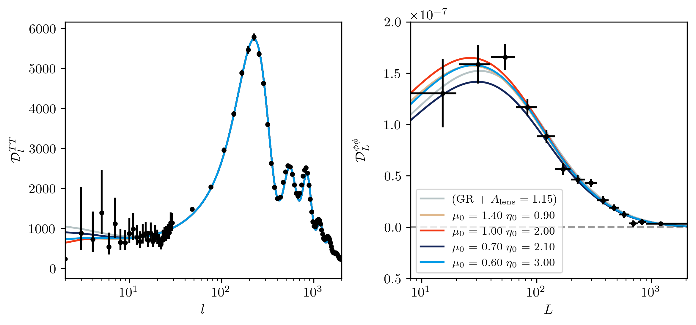

# mu_eta_data_plot
Plotting mu-eta modified gravity models against Planck data

## Quick Start
If you already have [MGCAMB](https://github.com/sfu-cosmo/MGCAMB) installed, you should just need to:
- Either install palettable (`conda install palettable`) or comment out the corresponding import in `src/make_plot.py`
- Change `mgcamb_dir` in `src/make_plot.py` to the appropriate directory
- Run `python src/make_plot.py`
- If you have already run the models you want and just need to fiddle with the plots, set `make_runs = False`

## Current caveats
- I have mixed data releases (PR2 for TT and PR3 for PhiPhi)
- I have applied `A_lens = 1.15` to the PhiPhi
- I have used the Planck2015 TT,TE,EE+lowP parameter values for the CAMB params
  (probably there are some CAMB params which could be set better)

## Installing MGCAMB
I was able to install MGCAMB using this list of conda packages from `conda-forge`:

`make python ipython compilers cython numpy matplotlib nose nose-parameterized parameterized`

and then dealing with the fortran issue in [this PR](https://github.com/sfu-cosmo/MGCAMB/pull/2) either as
described there or by breaking the appropriate line with a `&`.
